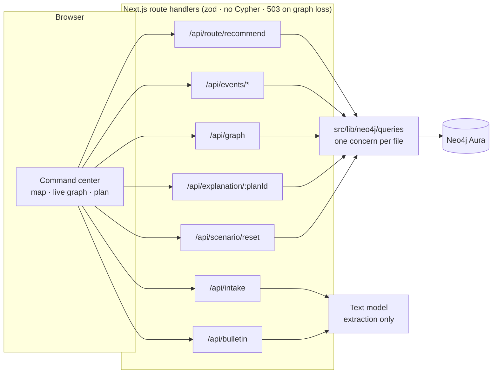
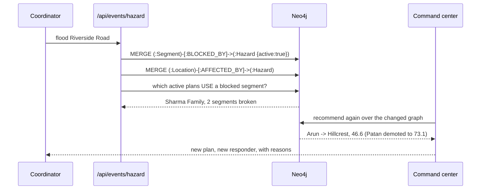

# LIFELINE

**Find the safest path that still exists.**

Lifeline is a flood-response command center where the plan is never written in advance.
It is computed, every time, from a live Neo4j graph of roads, bridges, hazards, shelters,
clinics, responders, vehicles, supplies and the households who need help. When a road
floods, the graph changes, the old plan is shown to be broken, and a different plan
appears — often with a different responder as well as a different route, because the same
water that closed the road also cut the volunteer off from the family.

`Neo4j Aura` · `Next.js 16` · `TypeScript` · `MapLibre GL` · `Cytoscape.js` · `OpenAI-compatible LLM (optional)`

> **Simulation.** Every person, shelter, volunteer and place in this app is fictional, set
> in an invented "Bagmati West" district. Nothing on screen is a live emergency feed.

**Contents** — [The problem](#the-problem-is-real) · [The scenario](#the-scenario) ·
[On screen](#what-happens-on-screen) · [Why the graph is the product](#why-the-graph-is-the-product) ·
[Scoring](#scoring-and-the-route-that-wins-by-losing-on-speed) ·
[How we used each technology](#how-we-used-each-technology) · [Architecture](#architecture) ·
[Measured results](#measured-results) · [Run it](#run-it) · [API](#api) · [Tests](#tests) ·
[Safety and limits](#safety-ethics-and-limitations) · [Roadmap](#roadmap)

---

## The problem is real

On 26 August 2026, a mass of rock and ice broke off in Nepal's Langtang valley and fell
roughly 1,200 metres, registering as a magnitude 5.2 event on seismometers. The resulting
surge travelled almost 100 km down the Trishuli, at points 70 metres above normal river
level, through Rasuwa and Nuwakot. More than 1,300 people were killed and around 5,500
remained missing a week later; the economic cost is estimated at $4–7 billion. Villages
and bridges were removed from the map entirely.
([Britannica](https://www.britannica.com/event/Nepal-floods-of-2026) ·
[The Conversation](https://theconversation.com/when-a-mountain-falls-how-ice-and-rock-triggered-nepals-catastrophic-flood-and-why-climate-change-is-raising-the-risks-290779))

Two years earlier, in the September 2024 monsoon floods, every major route out of the
Kathmandu Valley was blocked at the same time, with 17 road sections impassable, during
the heaviest rainfall since Nepal began modern hydrological monitoring in 1970.
([ScienceDirect](https://www.sciencedirect.com/science/article/pii/S2666592125000435))

The pattern in both: **people were not unreachable. They were unroutable.** Help existed.
Shelter existed. What nobody could compute, fast enough and for a specific household, was
a path that was still open.

A flood response needs the truth on two sides at once:

| The household that is stuck | The few people coordinating |
|---|---|
| "Where do we go? Is that road still there? Will someone come for my grandmother?" | "Reports arriving faster than anyone can read. Six vans. Which plans just broke?" |
| Needs one instruction they can act on now | Needs the whole picture, and a reason for every decision |

In a hill district the answer to both is a **path question**, and a path is only useful if
several unrelated facts hold simultaneously: the roads are open, a responder can reach
you, their vehicle fits your mobility needs, the shelter has beds, and the medicine you
depend on is somewhere you can get to. Any one of those can change in a minute, and when
it does, every plan that depended on it is silently wrong.

**Lifeline's thesis: you cannot write the protocol in advance, because the protocol
depends on facts that change by the minute. So the graph is the protocol.** Every fact is
a node or a relationship. Every event rewrites it. Every instruction is a traversal of the
graph as it is right now.

---

## The scenario

The demo follows one household through one night in the fictional district.

**06:42.** The Sharma family, Ward 3 Riverside Lane. Four people. Kamala, 71, cannot walk
far. Nirajan, 9, needs asthma medication. No usable vehicle. Floodwater rising at the end
of the lane.

Lifeline recommends **Maya Shrestha** with an accessible van, via Riverside Road to
**Patan Community Relief Center** — 21 minutes, 50 beds free after they arrive, step-free,
with **Patan Health Post 300 m away** holding salbutamol inhalers.

**06:52.** Riverside Road floods.

The plan does not degrade gracefully. It becomes wrong. Lifeline re-traverses the network
and returns **Arun Thapa**, via Hill Road to **Hillcrest School Relief Point**, with
**East Ward Clinic 600 m away**.

Both halves of the plan changed, and only one of those was the obvious one. Maya was
staged at the Ward 4 depot, whose only step-free access ran along the same corridor the
flood took. She did not become unavailable — she became **unreachable**, which is a
property of the graph, not a flag on her record. Nothing in the code special-cases this.
It falls out of the traversal.

Two other households sit in the same district and are visible on the map: the Gurung
family, who have their own car and need only shelter space, and the Tamang family, who
live directly on the river bend with an infant.

---

## What happens on screen

The command center has the map in the middle, the household situation on the left, the
live Neo4j graph on the right, and the plan with its evidence along the bottom.

| Step | What you see | What Neo4j does | Code |
|---|---|---|---|
| **Find a safe path** | The report becomes need chips; four beats tick through: extracting needs, checking active hazards, mapping reachable resources, finding viable paths | Intake writes the household's needs onto the graph, then one query enumerates every hazard-aware walk, matches transport and medicine, and ranks what survives | `src/lib/intake/`, `src/lib/neo4j/queries/recommend.ts` |
| **Traversal** | The graph lights node by node along the chain; the route draws itself on the map | The chain is built only from query results: family → need → responder → vehicle → segments → shelter → clinic → resource | `src/lib/service/recommendation.ts`, `src/components/graph/` |
| **Plan card** | *Maya Shrestha → Riverside Lane → Patan Community Relief Center*, with the evidence beside it | `RECOMMEND_CYPHER` returns the path, the transport and the care site in one result | `recommend.ts` |
| **How this was scored** | Each weighted term with its contribution, and the runner-up's score | Scores are computed inside Cypher and returned per dimension | `recommend.ts` |
| **Why this recommendation?** | Everything dims except the chain; each relationship lights with one line of reason | `EXPLAIN_PLAN_CYPHER` re-reads the stored plan's relationships | `src/lib/neo4j/queries/plans.ts` |
| **Flood road** | Alert slides in, the hazard footprint grows on the map, the route turns red and retracts | `ACTIVATE_HAZARD_CYPHER` MERGEs `BLOCKED_BY` edges and marks locations `AFFECTED_BY` | `src/lib/neo4j/queries/events.ts` |
| **Current plan compromised** | A recovery ladder: plan invalidated → re-traversing → new plan | `PLANS_INVALIDATED_BY_HAZARD_CYPHER` walks Hazard → Segment → `USES` → Plan → Family | `plans.ts` |
| **A new plan** | Different shelter *and* different responder, with the previous plan struck through | The same traversal over the changed graph | `recommend.ts` |
| **Fill shelter / Stand down responder** | Different breakages, different answers | Capacity or availability changes; plans re-derived | `events.ts` |
| **Field update** | Free text becomes graph changes, with a diff of what was applied and what was not matched | Parsed, validated, then applied through controlled parameterised writes | `src/lib/intake/bulletin.ts`, `apply.ts` |
| **Graph view** | The Cypher that ran, per-query timings, row counts, and every rejected destination with its reason | Trace collected from each call; `REJECTED_CYPHER` explains the destinations *not* chosen | `src/lib/neo4j/client.ts`, `rejected.ts` |
| **Reset** | Clean seed state | Restores statuses, capacities, availability, household needs; removes runtime hazards and alerts | `src/lib/neo4j/seed.ts` |

---

## Why the graph is the product

If Neo4j is unreachable, Lifeline shows **"Lifeline cannot reason right now"** and refuses
to answer. Nothing is precomputed, and the browser never holds a copy of the world it
could reason over on its own. Every plan on screen came from the last query.

### The model: roads are nodes, not relationships

```
(:Location)<-[:CONNECTS]-(:Segment:Road|:Bridge {status, travelMinutes, floodRisk, accessibility})-[:CONNECTS]->(:Location)
(:Segment)-[:BLOCKED_BY]->(:Hazard {active})
(:Location)-[:AFFECTED_BY]->(:Hazard)
(:Family)-[:HAS_MEMBER]->(:Person)-[:HAS_NEED]->(:Need)
(:Family)-[:HAS_NEED]->(:Need)
(:Family)-[:LOCATED_AT]->(:Location)
(:Shelter|:CareSite)-[:LOCATED_AT]->(:Location)
(:Location)-[:NEAR {meters}]->(:Location)
(:Shelter|:CareSite)-[:HAS_RESOURCE]->(:Resource)-[:SATISFIES]->(:Need)
(:Volunteer)-[:AVAILABLE_AT]->(:Location)
(:Volunteer)-[:HAS_VEHICLE]->(:Vehicle)-[:SUPPORTS_NEED]->(:Need)
(:Volunteer)-[:CAN_ASSIST]->(:Need)
(:Plan)-[:USES]->(:Segment|:Shelter|:Volunteer|:Vehicle|:CareSite)
(:Plan)-[:FOR_FAMILY]->(:Family)
(:Alert)-[:AFFECTS]->(:Segment|:Shelter)
```

**13 node types, 15 relationship types.**

The single decision everything else rests on is that a road is a **node**. The alternative
— connectivity as a relationship, `(:Location)-[:CONNECTED_TO {roadId, status}]->(:Location)` —
was rejected for a structural reason, not a stylistic one:

> Neo4j has no relationship-to-relationship edges. A road modelled as a relationship can
> never be the **target** of `(:Segment)-[:BLOCKED_BY]->(:Hazard)`, the object of a
> `(:Plan)-[:USES]->` edge, or an addressable entity the UI can pulse red. The reason a
> road is unusable would have to live in a status string somewhere, maintained by hand.

With segments as nodes, blocking a road is one `MERGE` of one edge, and *every* candidate
path crossing that segment is invalidated inside the same traversal that finds paths.
There is no derived copy of the network to keep in sync, so the map, the graph panel and
the router cannot disagree about what is open.

The accepted cost: the physical network is **bipartite**, so every segment is two hops and
journeys are undirected variable-length walks, `[:CONNECTS*2..24]` — at most twelve
segments. That bound is also a product rule. A twelve-segment route is not one you hand to
a family in a flood.

### One definition of "passable", written once

Everything hinges on a single predicate, interpolated into every traversal so the route
query, the pickup query and the rejection analysis can never disagree:

```cypher
NOT n:Segment OR (
  n.status <> 'blocked'
  AND NOT exists((n)-[:BLOCKED_BY]->(:Hazard {active: true}))
  AND (requireTransport = false OR n.accessibility <> 'foot_only')
  AND (requireStepFree  = false OR n.accessibility = 'full')
)
```

This is the mechanism, and it is worth being precise about why it matters. A segment is
not rejected because something copied a flag onto it. It is rejected **because an edge
exists**, evaluated as the path is being built. Activating a hazard writes one
relationship; the next traversal sees a different world.

It also encodes the two accessibility traps in the district. `seg_khola_footbridge` is a
genuine three-minute link to Hill Road that **no vehicle can use**, so it silently
disappears for a household travelling by accessible van. `seg_bagmati_crossing` is the
deceptive shortcut: nine minutes end to end, less than half of any viable option, but the
bridge is scoured *and* it leads to the one shelter without step-free access.

### The questions Lifeline asks

Sixteen named Cypher statements across six files, one file per concern.

| File | Statements | What it answers |
|---|---|---|
| `recommend.ts` | `RECOMMEND_CYPHER` | The whole question in one query: needs, transport, every viable walk, resource match, ranking |
| `rejected.ts` | `REJECTED_CYPHER` | For every destination *not* chosen, why: capacity, accessibility, or hazard-blocked connectivity |
| `missingLink.ts` | `RELAXED_FEASIBILITY_CYPHER`, `NEAREST_ACCESSIBLE_RESPONDER_CYPHER`, `NEAREST_SAFE_WAIT_POINT_CYPHER` | When nothing works, which single constraint would unlock a route |
| `plans.ts` | `PERSIST_PLAN_CYPHER`, `PLANS_INVALIDATED_BY_HAZARD_CYPHER`, `PLANS_COMPROMISED_CYPHER`, `EXPLAIN_PLAN_CYPHER` | Store a plan in the graph, ask which plans an event just broke, explain one |
| `events.ts` | `ACTIVATE_HAZARD_CYPHER`, `DEACTIVATE_HAZARD_CYPHER`, `BLOCK_SEGMENT_CYPHER`, `SET_SHELTER_FULL_CYPHER`, `SET_VOLUNTEER_STATUS_CYPHER`, `HAZARD_RIPPLE_CYPHER` | Disruptions as graph writes |
| `graphSnapshot.ts` | `GRAPH_SNAPSHOT_CYPHER`, `GRAPH_EDGES_CYPHER`, `SCENARIO_STATE_CYPHER` | One projection the map and the graph panel both render |

Three of these do work a relational lookup structurally cannot:

**The recommendation** enumerates walks with `[:CONNECTS*2..24]`, filters them mid-traversal
with a pattern predicate inside `all()`, folds each surviving path into travel time, summed
flood exposure, worst segment and hazard-zone count with `reduce()`, then matches medicine
through `Shelter -> NEAR -> CareSite -> HAS_RESOURCE -> Resource -> SATISFIES -> Need` — all
in one statement, ordered by a score computed in the same query.

**Plan invalidation** is a one-hop traversal from the event, not a diff computed on the
client:

```cypher
MATCH (h:Hazard {id: $hazardId})<-[:BLOCKED_BY]-(seg:Segment)<-[:USES]-(plan:Plan)-[:FOR_FAMILY]->(fam:Family)
WHERE plan.status = 'active' AND h.active = true
SET plan.status = 'compromised'
RETURN plan.id, fam.name, collect(DISTINCT seg {.id, .name}) AS brokenSegments
```

Because plans are stored as `(:Plan)-[:USES]->`, asking "what did this flood just break?"
is a question you ask the graph, not a comparison you compute.

**The missing link** answers the case everyone else renders as an empty state. When no plan
exists, Lifeline relaxes one constraint at a time and asks the graph which relaxation
brings plans back, then names the nearest thing that would satisfy it:

> **No complete safe path currently exists.**
> Missing link: **wheelchair-accessible transport.**
> Sunita Lama has an accessible vehicle but is 3.2 km outside the response zone at Valley
> General Hospital.

---

## Scoring, and the route that wins by losing on speed

Ranking happens inside Cypher, and each weighted term is returned separately so the UI can
show *which* term decided the outcome. Lower is safer.

| Term | Weight | Computed from |
|---|---|---|
| Travel time | `1.0` / min | Sum of `travelMinutes` over the path |
| Route flood exposure | `12.0` × Σ risk | Summed per-segment `floodRisk` |
| Worst single segment | `10.0` × max | The highest-risk segment on the route |
| **Active hazard zones crossed** | **`30.0` each** | Path nodes with an `AFFECTED_BY` edge to an active hazard |
| Destination capacity | `−0.25` / bed (cap 60) | Beds free after the household arrives |
| Distance to medicine | `1.2` / 100 m | `NEAR` distance to a care site stocking the needed resource |
| No reachable clinic | `60.0` | Applied when a medical need has no reachable site |
| Responder pickup | `0.6` / min | Minutes for the matched responder to reach the family |

The weights encode a policy: **safety outranks accessibility and resource fit, which
outrank reachability, which outranks speed.** The hazard-zone term is deliberately the
largest single penalty, because crossing an active flood footprint is categorically
different from taking a slower road.

This produces a result that is worth pausing on. **After the flood, Hillcrest (25 min)
beats Patan (23 min) — the slower route wins.**

```
BASELINE          Patan Community Relief Center   38.7   21 min   0 hazard nodes
                  Hillcrest School Relief Point   45.4   25 min   0 hazard nodes

AFTER FLOOD       Hillcrest School Relief Point   46.6   25 min   0 hazard nodes   ← now best
                  Patan Community Relief Center   73.1   23 min   1 hazard node
```

Patan is still physically reachable after the flood, by an inland detour that is actually
*two minutes shorter* than the hill route. It loses because that detour must pass through
Patan Gate, which sits inside the active flood footprint — one `AFFECTED_BY` edge, +30.
The system is not choosing the shortest road. It is choosing the one that does not walk a
family with a 71-year-old and a 9-year-old through moving water to save two minutes.

The demo's four states all fall out of the same scoring. None are special-cased:

| State | Destination | Responder | Score |
|---|---|---|---|
| Baseline | Patan Community Relief Center | Maya Shrestha | 38.7 |
| Riverside Road flooded | Hillcrest School Relief Point | **Arun Thapa** | 46.6 |
| Patan at capacity | Hillcrest School Relief Point | Maya Shrestha | 45.4 |
| Maya unavailable | Patan Community Relief Center | Arun Thapa | 39.9 |
| No accessible responder | *no route* — missing link named | — | — |

`npm run truth` asserts all nine of these expectations against the live graph.

---

## How we used each technology

### Neo4j Aura

**The instance.** A single Aura Free instance over encrypted Bolt (`neo4j+s://`) with the
official `neo4j-driver` v6, from Next.js route handlers only — the browser never talks to
Neo4j. One quirk worth documenting: this instance type authenticates with the **instance
id as both the username and the database name**, not the conventional `neo4j`/`neo4j`. A
wrong guess fails as a bare "unauthorized" with no hint which field is wrong.

**Schema.** `npm run neo4j:init` issues idempotent DDL: **14 uniqueness constraints and 7
indexes**. The constraints are not only correctness — the seed `MERGE`s on `id` throughout,
and without the backing index every `MERGE` degrades to a label scan. The seven indexes are
exactly the properties the traversals filter on (`Segment.status`, `Hazard.active`,
`Volunteer.status`, `Shelter.status`, `Need.kind`, `Resource.type`, `Plan.familyId`),
chosen by reading the query set rather than guessed.

**Seed.** `npm run seed` writes the district in batched `UNWIND` statements and reports
every label and relationship count: **107 nodes and 156 relationships** at seed state — 20
locations, 26 segments (3 of them bridges), 4 shelters, 4 care sites, 7 volunteers, 7
vehicles, 13 resources, 3 families, 12 people, 7 needs, 4 hazards.

**Failing loudly.** Every call goes through one `execute()` wrapper that turns any failure —
auth rejection, timeout, network drop — into a single `GraphUnavailableError`, which is the
only thing route handlers map to `503 GRAPH_UNAVAILABLE`. The alternative, quietly returning
an empty array, would be indistinguishable from *"no safe route exists"* — which is a real
and important answer this system also has to give. Conflating the two would make the product
lie at exactly the moment it matters most.

**The query trace.** Each recommendation returns not just an answer but which Cypher ran,
how long each statement took, and how many rows it returned, rendered verbatim in the
judge-facing Graph view. At baseline: **51 candidate walks enumerated, 22 surviving the
predicates**, across 2 named queries.

**Deterministic reset.** `resetToBaseline()` is a state *revert*, not a wipe-and-reseed —
a teardown risks leaving the graph empty if it fails halfway, which is not a state to
discover thirty seconds before presenting. It restores every seeded status, capacity,
occupancy and availability, removes runtime hazards and alerts, and undoes household-level
intake writes. The rule that keeps it honest: **any new graph-write feature needs a
matching undo here**, or the reset guarantee silently weakens.

### Language models

The model turns unstructured text into validated data. **It never decides anything.**

| Step | Who does it | Guard |
|---|---|---|
| Report text → household needs | Text model via any OpenAI-compatible endpoint | zod schema, 8s timeout, and a deterministic rule-based extractor that always runs |
| Field bulletin → graph updates | Same | Parsed to enum actions, matched to entities that already exist, applied via parameterised Cypher |
| Routes, shelters, responders, ranking, explanations | **Neo4j only** | No model output is ever executed as Cypher |

The extractor and the model are **unioned, not swapped**. During development the model
classified "my grandmother cannot walk far" as a free-text constraint rather than emitting
`mobility_assistance` — a silent omission of a safety-relevant need. The union makes that
class of miss impossible: the rules always run, and the model can only add. The UI labels
which path produced each result, and **the entire demo runs with no model key configured.**

### MapLibre GL

The district is fictional, so there is no basemap. A real one would show real streets that
contradict our road graph, and would make the demo depend on a tile server. Instead the map
renders a **fully synthetic vector world** built in code from the same `world.ts` the seed
uses: district boundary, river, elevation relief, every road and bridge, and hazard
footprints — with no `glyphs` URL, which means no `symbol` layers, which means every label
and icon is a DOM marker.

One trap worth recording, because it costs hours and produces no error. **MapLibre 6
resolves its web worker with `new URL('./maplibre-gl-worker.mjs', import.meta.url)`, which
bundlers do not rewrite.** Inside a Next.js bundle that URL 404s, and MapLibre does not
throw: GeoJSON sources simply never finish parsing, so the map paints nothing, fires no
`load` event and reports no error. The fix is `scripts/copy-maplibre-worker.mjs`, wired to
`predev`/`prebuild`, which stages the worker under `public/` for `setWorkerUrl()`.

### Cytoscape.js

A **deterministic preset layout**, never a force layout. A force-directed graph settles
differently on every run, which means the traversal animation lands somewhere new each time
you present. Positions are computed by type into bands, with the road network projected
from real latitude and longitude so the graph panel is a second view of the same world as
the map. A damped relaxation pass de-overlaps the lattice: measured **zero collisions, with a
20.1 px minimum separation** between any two placed nodes.

### Next.js, React, Tailwind, Motion

One scene machine (`useLifeline.ts`) drives the map, the graph and the cards from the same
transition, so the three views move together. Design tokens carry three signal colours with
fixed meanings — accent for a path that exists, amber for a condition to watch, red for
something that no longer holds. Status is never conveyed by colour alone.

### How it was built

Built with parallel AI agents under a single integrating lead, with **disjoint file
ownership** so concurrent agents could not collide: one on the graph service and Cypher,
one on the map, one on the graph visualisation, one on natural-language intake, one on
tests and documentation, and a later design pass split across the design system, the
command center and the hero.

The sequencing mattered more than the parallelism. The shared world module and the API
contracts were frozen **first**, before any agent started, because parallel agents without
a frozen contract invent conflicting ids and the integration phase is spent reconciling
them. The core traversal was then validated against a truth table of the four demo states
before a single line of UI existed — if the scripted outcomes had not fallen out of the
graph's own scoring, no amount of UI polish would have saved the demo.

Agents found real bugs in each other's work, which is the point: a plan-persistence query
whose non-optional `MATCH` silently skipped every `USES` edge, resources declaring needs
that had no `Need` node so the `SATISFIES` edge was never created, a pickup traversal
searching half its documented depth, and a graph layout that focused the wrong household
because its fallback sorted family ids alphabetically.

---

## Architecture



The disruption path, end to end:



---

## Measured results

Against live Aura, 12 September 2026:

| Measure | Result |
|---|---|
| Baseline plan | Maya Shrestha (Accessible Community Van 2) → Patan Community Relief Center · 21 min · 5 min pickup · 50 beds free · Patan Health Post 300 m |
| After flooding Riverside Road | Arun Thapa (Accessible Relief Van 5) → Hillcrest School Relief Point · 25 min · 7 min pickup · East Ward Clinic 600 m |
| Patan after the flood | Still reachable, demoted 38.7 → 73.1 (crosses one active hazard zone) |
| Recommendation latency | ~831 ms cold, **~150–166 ms warm** |
| Candidate walks | 51 enumerated, 22 surviving the predicates |
| Seed state | 107 nodes · 156 relationships · 14 constraints · 7 indexes |
| Reset | Deterministic; truth table passes identically after repeated disruptions |
| Graph layout | 0 collisions; 20.1 px minimum separation between any two nodes |
| Tests | **94 passing** against live Aura |
| Demo truth table | **9/9 expectations met** |

---

## Run it

**Prerequisites:** Node.js 20+, a free [Neo4j Aura](https://console.neo4j.io) instance. A
model key is optional — without one, intake uses the deterministic extractor.

```bash
npm install
cp .env.example .env.local     # Aura credentials; model keys optional
npm run neo4j:init             # constraints + indexes (idempotent)
npm run seed                   # seed the district, verify counts
npm run dev                    # http://localhost:3000
```

| Script | What it does |
|---|---|
| `npm run setup` | install, then `neo4j:init`, then `seed` |
| `npm run seed` | Wipe and reseed the district, printing every label and relationship count |
| `npm run reset` | Restore the demo graph to seed state |
| `npm run truth` | Run all four demo states against the live graph and assert the nine expectations |
| `npm test` | 94 tests, integration tests run against live Aura |

**Troubleshooting**

- *"Lifeline cannot reason right now"* — check `.env.local`. Note that Aura Free often uses
  the **instance id** as both username and database, not `neo4j`.
- *Connected but empty* — run `npm run seed`.
- *No viable path on first load* — a previous run left roads flooded. Press **Reset**.
- *The map is blank* — the browser window must be **foregrounded**. Hidden tabs pause
  `requestAnimationFrame`, so WebGL never paints. This is a browser behaviour, not a bug.

---

## API

| Method | Path | Body | Returns |
|---|---|---|---|
| GET | `/api/health` | — | Neo4j connectivity and version |
| GET | `/api/graph` | — | `{nodes, edges}` shared by map and graph panel |
| GET | `/api/scenario` | — | Live counters, active hazards, blocked segments, district geometry |
| POST | `/api/route/recommend` | `{familyId, persist?}` | Ranked plans, transport, chain, rejections, missing links, query trace |
| GET | `/api/recommendation/[familyId]` | — | Same, without persisting a `(:Plan)` |
| GET | `/api/explanation/[planId]` | — | The ordered relationships behind a stored plan |
| POST | `/api/events/hazard` | `{hazardId, active?}` | Impacted ids, invalidated plans, alert |
| POST | `/api/events/road-block` | `{segmentId}` | Same shape |
| POST | `/api/events/shelter-full` | `{shelterId}` | Same shape |
| POST | `/api/events/volunteer` | `{volunteerId, status?}` | Same shape |
| POST | `/api/intake` | `{familyId, text?, structured?}` | Extracted situation and what was written to the graph |
| POST | `/api/bulletin` | `{text}` | Structured diff of applied changes and unmatched phrases |
| POST | `/api/scenario/reset` | — | Restores baseline |

Errors use `{error, code}` with `BAD_REQUEST` (400), `NOT_FOUND` (404),
`GRAPH_UNAVAILABLE` (503) or `INTERNAL` (500). Every handler validates input with zod and
contains no Cypher.

---

## Tests

`npm test` runs **94 tests**. The integration tests run against the live Aura instance
rather than mocks, because the things that actually break are the Cypher and the graph
shape, and a mock hides exactly those. Every test resets to baseline first.

- **`tests/graph.test.ts`** — a blocked road never appears in a returned route; an
  inaccessible shelter is rejected for a mobility-constrained household; a shelter at
  capacity is rejected; removing the recommended road yields a different viable route; an
  unavailable responder is never used; the required medication is satisfied at the chosen
  destination; the no-route case names the missing link; reset is deterministic. Plus the
  second-order test: after the flood, **both** destination and responder change.
- **`tests/scoring.test.ts`** — topology invariants with no database: every segment,
  shelter, care site, volunteer and resource references a real id; the network is
  connected; the accessibility traps exist; and every resource kind has a `Need` node, so
  no `SATISFIES` edge can be silently dropped.
- **`src/lib/intake/__tests__/`** — the extractor, with no network and no database.

`npm run truth` is separate and blunter: it drives all four demo states through the live
graph and fails if any scripted outcome stops being a property of the data.

---

## Project structure

```
lifeline/
├── src/
│   ├── app/
│   │   ├── api/                  route handlers (thin; all reasoning is Cypher)
│   │   ├── page.tsx              hero, district drawn from the world data
│   │   └── command/page.tsx      command center
│   ├── components/
│   │   ├── command/              scene machine, header, situation, plan band, overlays
│   │   ├── map/                  MapLibre synthetic world, markers, tooltip
│   │   └── graph/                Cytoscape live graph, deterministic layout
│   └── lib/
│       ├── neo4j/client.ts       driver, failure mapping, query trace
│       ├── neo4j/queries/        one concern per file
│       ├── neo4j/seed.ts         seed + deterministic reset
│       ├── service/              recommendation and scenario orchestration
│       ├── intake/               rules extractor, LLM client, controlled graph writes
│       ├── world/world.ts        the district: single source of truth for seed AND map
│       └── types.ts              contracts shared by API, map, graph and UI
├── scripts/                      init, seed, reset, truth table, maplibre worker
├── tests/                        integration tests against Aura
└── docs/GRAPH_MODEL.md           deeper graph reference
```

`world.ts` is deliberately the single source of truth for **both** the Neo4j seed and the
map geometry, so the rendered world and the reasoned-over world cannot drift apart.

---

## Safety, ethics and limitations

- Every recommendation carries: *Recommended based on currently available information ·
  Conditions may change · Follow official emergency instructions · Call local emergency
  services for immediate life-threatening danger.*
- All data is fictional and labelled as simulation on every screen.
- Lifeline is decision-support for coordination. It does not dispatch responders and does
  not replace official warnings.
- **Before any real pilot**, this would need: real road, bridge and shelter data kept
  current by the municipality; corroboration of crowd reports from several sources before a
  road is closed for everyone; channels that work on feature phones and during outages, in
  Nepali and local languages; a named human approving authority-side actions with an audit
  trail; and a clear line of responsibility with the official response.
- Routing quality is bounded by the graph. A road marked open that is not open produces a
  confidently wrong answer, which is why `BLOCKED_BY` carries the hazard as structure and
  why every recommendation shows its evidence rather than only its conclusion.

---

## Roadmap

- **Responder mode** — invert the question from "where does this family go?" to "which
  single intervention unblocks the most households?" The graph already supports it:
  `HAZARD_RIPPLE_CYPHER` measures downstream connectivity from any change.
- **Graph Data Science** — weighted shortest paths and capacity-constrained assignment once
  there are hundreds of households rather than three.
- **MCP for Aura** — expose the same read queries to an operator's assistant.
- **Document ingestion** — municipal shelter lists and situation reports into graph updates.
